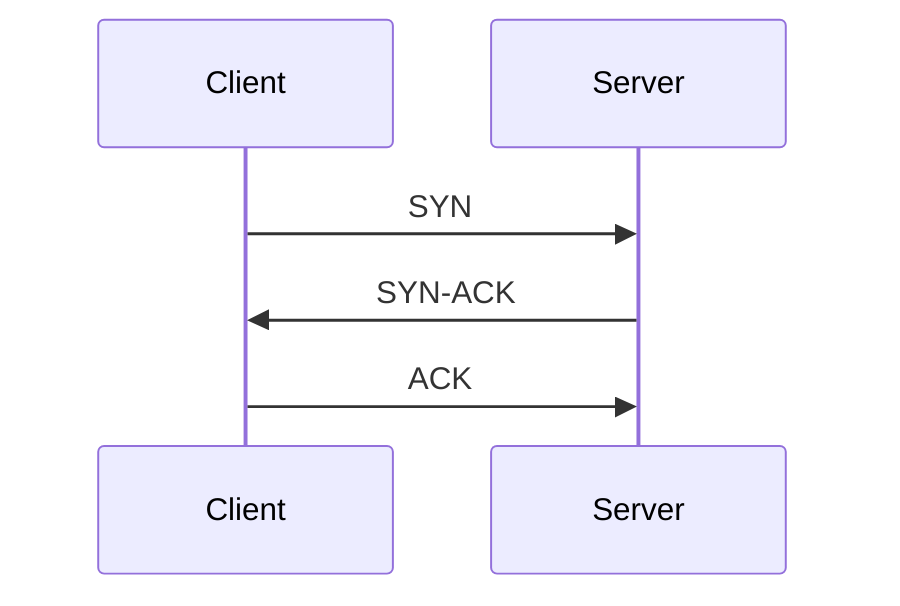
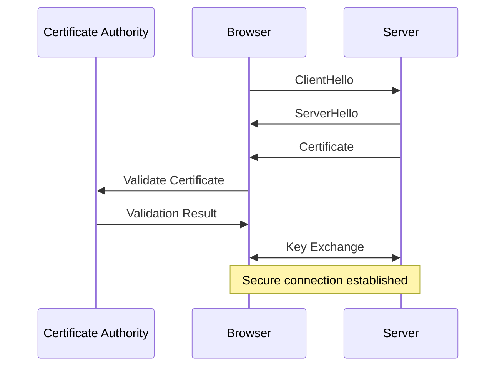

# Understanding "Online"

## The Internet: A Network of Networks
- The internet is a vast collection of interconnected networks.
- Each device on the internet is part of a network.

---

# How the Internet Works

## The Journey of a Web Request
- When you type "www.google.com" in your browser, a series of steps occur to display the webpage.

---

# DNS Resolution

## What is DNS?
- DNS (Domain Name System) translates domain names like "www.google.com" into IP addresses.

## How It Works
- When you enter "www.google.com" in your browser, a DNS request is sent to resolve the domain name to an IP address.
- The request typically asks for an "A" record, which maps the domain to an IPv4 address.

```plaintext
Query: www.google.com
Type: A
```

- Your browser contacts a DNS server to find the IP address of "www.google.com".
- The DNS server responds with the IP address, allowing your browser to connect to Google's servers.

---

# Establishing a Connection

## TCP/IP Protocol
- Your browser uses the TCP/IP protocol to establish a connection with Google's server.
- TCP ensures reliable data transmission, while IP handles addressing and routing.

---

## TCP Handshake
- The TCP handshake is a three-step process to establish a connection:
  1. **SYN**: The client sends a synchronization packet to the server.
  2. **SYN-ACK**: The server acknowledges with a synchronization-acknowledgment packet.
  3. **ACK**: The client sends an acknowledgment packet back to the server.



---

## HTTPS: Secure Communication
- HTTPS (Hypertext Transfer Protocol Secure) encrypts data between your browser and the server.
- It relies on SSL/TLS protocols to secure the data.
- Certificates are used to verify the identity of websites.
- Certificate Authorities (CAs) issue these certificates, ensuring trust.
- When you visit a secure site, your browser checks the certificate against a list of trusted CAs.
- This process ensures that your connection is secure and the site is legitimate.

---



---

# Requesting the Webpage

## HTTP Request
- Your browser sends an HTTP request to Google's server, asking for the webpage.

```http
GET / HTTP/1.1
Host: www.google.com
User-Agent: Mozilla/5.0 (Windows NT 10.0; Win64; x64) AppleWebKit/537.36 (KHTML, like Gecko) Chrome/58.0.3029.110 Safari/537.3
Accept: text/html,application/xhtml+xml,application/xml;q=0.9,image/webp,*/*;q=0.8
Accept-Language: en-US,en;q=0.5
Accept-Encoding: gzip, deflate, br
Connection: keep-alive
Upgrade-Insecure-Requests: 1
```

## Server Response
- Google's server processes the request and sends back the HTML, CSS, and JavaScript needed to render the page.

---

# Rendering the Page

## Browser Rendering
- Your browser interprets the HTML, CSS, and JavaScript to display the webpage.
- It constructs the Document Object Model (DOM) and applies styles and scripts.

