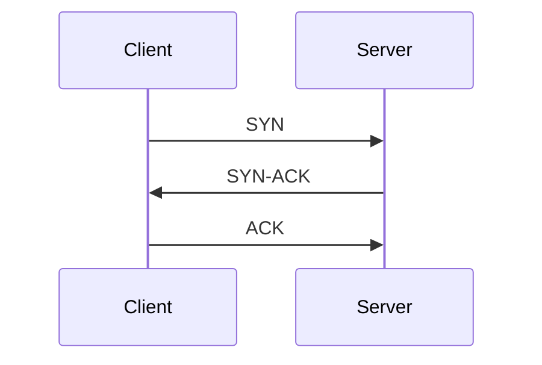
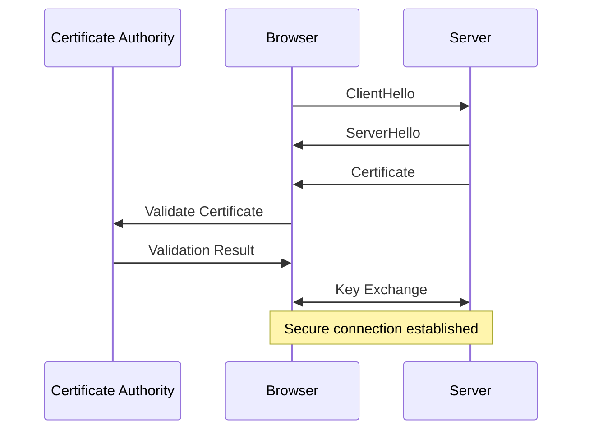

# Understanding "Online"

## The Internet: A Network of Networks
- The internet is a vast collection of interconnected networks.
- Each device on the internet is part of a network.

---

# How the Internet Works

## The Journey of a Web Request
- When you type "www.google.com" in your browser, a series of steps occur to display the webpage.

---

# DNS Resolution

<v-click>

## What is DNS?
- DNS (Domain Name System) translates domain names like "www.google.com" into IP addresses.
- Here's how it works:
</v-click>


<VClickList>

- When you enter "www.google.com" in your browser, a DNS request is sent to resolve the domain name to an IP address.

- The request typically asks for an "A" record, which maps the domain to an IPv4 address.
    ```plaintext
    Query: www.google.com
    Type: A
    ```

- Your browser contacts a DNS server to find the IP address of "www.google.com".

- The DNS server responds with the IP address, allowing your browser to connect to Google's servers.
</VClickList>


---
transition: view-transition
mdc: true
layout: center
---

# Establishing a Connection  {.inline-block.view-transition-tra}

## TCP/IP Protocol
<VClickList>

- Your browser uses the TCP/IP protocol to establish a connection with Google's server.
- TCP ensures reliable data transmission, while IP handles addressing and routing:

    -  **Addressing**: This refers to the method of assigning a unique identifier (IP address) to each device on a network, allowing data to be sent to the correct destination. This means reusing a lot of IPs, and keeping track which is which.

    - **Routing**: This is the process of determining the path that data packets take from the source to the destination across interconnected networks. This is distributed and fault-resistant. Sometimes undersea cables break!

</VClickList>


---
transition: view-transition
mdc: true
layout: center
---

# Establishing a Connection: TCP  {.inline-block.view-transition-tra}
- The TCP handshake is a three-step process to establish a connection:

<VClickList>

- **SYN**: The client sends a synchronization packet to the server.

- **SYN-ACK**: The server acknowledges with a synchronization-acknowledgment packet.

- **ACK**: The client sends an acknowledgment packet back to the server.

</VClickList>

---
layout: center
---



---
transition: view-transition
mdc: true
---

# Establishing a Connection: HTTPS {.inline-block.view-transition-tra}

<VClickList>

- HTTPS (Hypertext Transfer Protocol Secure) encrypts data between your browser and the server.
- It relies on SSL/TLS protocols to secure the data.
- Certificates are used to verify the identity of websites.
- Certificate Authorities (CAs) issue these certificates, ensuring trust.
- When you visit a secure site, your browser checks the certificate against a list of trusted CAs.
- This process ensures that your connection is secure and the site is legitimate.

</VClickList>
---



---

# Requesting the Webpage

## HTTP Request
- Your browser sends an HTTP request to Google's server, asking for the webpage.

```http
GET / HTTP/1.1
Host: www.google.com
User-Agent: Mozilla/5.0 (Windows NT 10.0; Win64; x64) AppleWebKit/537.36 (KHTML, like Gecko) Chrome/58.0.3029.110 Safari/537.3
Accept: text/html,application/xhtml+xml,application/xml;q=0.9,image/webp,*/*;q=0.8
Accept-Language: en-US,en;q=0.5
Accept-Encoding: gzip, deflate, br
Connection: keep-alive
Upgrade-Insecure-Requests: 1
```

---

## Server Response

- Google's server processes the request and sends back the HTML (and CSS, and JavaScript, usually separately) needed to render the page.

<VClickList>

- **Load Balancer**: The request first hits a load balancer, which distributes incoming traffic across multiple servers to ensure no single server is overwhelmed. This helps in maintaining high availability and reliability.

- **App Server Selection**: The load balancer selects an appropriate application server to handle the request. This server is responsible for processing the request and generating the response.

- **Routing and Caching**: The selected app server likely has a router that determines how to handle the request. It may render the home page directly or fetch it from a cache if available, improving response time and reducing server load. It returns HTML in the response.

</VClickList>


---

# Rendering the Page

## Browser Rendering

<VClickList>

- Your browser interprets the HTML to display the webpage.
- It constructs the Document Object Model (DOM) and applies styles and scripts.
- It also fetches JavaScript and CSS files, which are loaded based on their order in the HTML and various frontend optimization techniques. This can include asynchronous loading, deferred execution, and caching strategies to enhance performance and user experience.
- It also executes all the javascript code necessary.

</VClickList>
